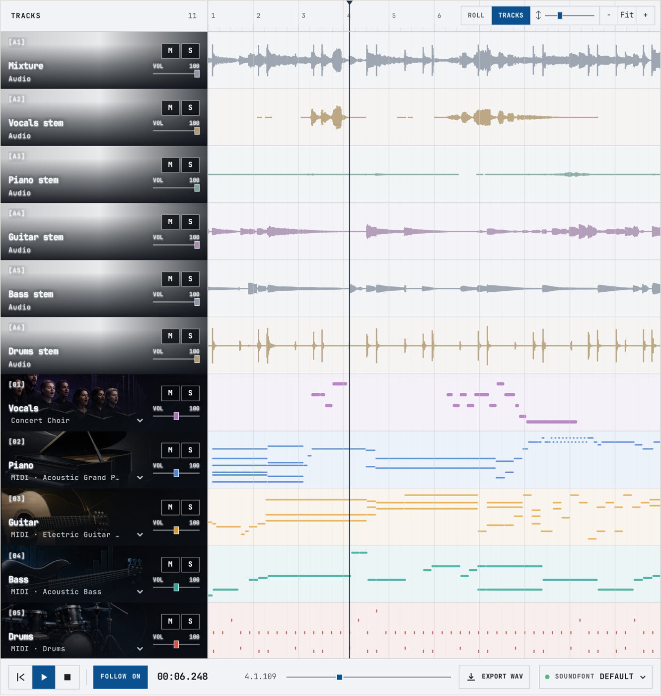

# midi-realplayer

[](https://www.npmjs.com/package/midi-realplayer)
[](https://www.jsdelivr.com/package/npm/midi-realplayer)
[](LICENSE)

A drop-in MIDI player for the web. One tag gives a MIDI file a DAW-style
track view, a piano roll, a mute/solo mixer, and SoundFont sound. Audio
recordings, such as the stems a transcription came from, play in step as
extra tracks.

**[Live demo](https://vaclisinc.github.io/midi-realplayer-web/)**



```html
<script type="module" src="https://cdn.jsdelivr.net/npm/midi-realplayer"></script>

<midi-realplayer src="song.mid"></midi-realplayer>
```

That is the whole setup: no build step, no SoundFont to host. It suits
transcription and generation demo pages, listening tests, and course pages.

## Features

- **Tracks and Roll views.** Tracks (the default) shows one lane per track;
  Roll is a piano roll. Single-track and multi-track files use the same
  interface.
- **Mixer.** Mute, solo, volume, and a per-track SoundFont instrument menu.
- **Faithful playback** through [SpessaSynth](https://github.com/spessasus/SpessaSynth):
  tempo map, velocities, program and bank changes, drums, and sustain pedal.
- **Audio tracks.** Recordings sit above the MIDI with their waveforms and
  share the synthesizer's audio clock, so they stay in step through play,
  pause, seek, and mute or solo changes.
- **WAV export** of the audible tracks, including the recordings.
- **Many players per page.** They share one SoundFont download, and starting
  one pauses the others.
- **Contained.** The player renders in a shadow root, so page styles and
  player styles do not leak into each other. Light and dark themes follow the
  viewer's system setting.

## Usage

### From a CDN

```html
<script type="module" src="https://cdn.jsdelivr.net/npm/midi-realplayer@0.1"></script>
```

Pin a version (as above) on pages you want to keep working. A classic script
tag also works and exposes a `MidiRealPlayer` global:

```html
<script src="https://cdn.jsdelivr.net/npm/midi-realplayer@0.1/dist/midi-realplayer.iife.js"></script>
```

### From npm

```sh
npm install midi-realplayer
```

```js
import "midi-realplayer"; // registers <midi-realplayer>
```

The package has no runtime dependencies. With a bundler (Vite, webpack,
esbuild), the player loads its worklet, SoundFont, artwork and font from the
same version on jsDelivr. To serve them yourself, see
[Self-hosting](#self-hosting).

### Audio tracks

```html
<midi-realplayer src="transcription.mid">
  <midi-realplayer-audio src="mix.mp3" label="Mixture"></midi-realplayer-audio>
  <midi-realplayer-audio src="vocals.mp3" label="Vocals stem"></midi-realplayer-audio>
  <midi-realplayer-audio src="bass.mp3" label="Bass stem" offset="0.25"></midi-realplayer-audio>
</midi-realplayer>
```

`offset` is the number of seconds into the MIDI where the recording starts;
a negative value trims the start of the recording. A single recording can
also go in the `audio` attribute of `<midi-realplayer>` (with `audio-label`
and `audio-offset`).

Recordings are decoded into memory: about 10 MB per 30 s of stereo audio.
That is fine for clips and songs, not for hour-long files.

## Attributes

| attribute | effect |
|---|---|
| `src` | MIDI file URL (required) |
| `view-mode` | `arrangement` (Tracks, default) or `piano-roll` |
| `theme` | `light` or `dark`; follows the system setting when omitted |
| `soundfont` | SF2, SF3 or DLS URL; defaults to GeneralUser GS |
| `file-name` | name shown in messages and used for the exported WAV |
| `persist-key` | remember mute, solo, volume and view per visitor in `localStorage` |
| `preload` | download the SoundFont at once instead of on first play |
| `asset-base` | folder holding the player's assets; see [Self-hosting](#self-hosting) |
| `audio`, `audio-label`, `audio-offset` | one recording without a child element |
| `no-export` | hide the Export WAV button |
| `no-custom-soundfont` | hide the option to load a SoundFont from disk |
| `no-exclusive` | keep playing when another player on the page starts |

The player's height fits its tracks (between 14 and 32 rem). Set a height in
CSS to override it:

```css
midi-realplayer { height: 24rem; }
```

## JavaScript

```js
const player = document.querySelector("midi-realplayer");

player.addEventListener("play", () => console.log("playing"));
player.addEventListener("pause", () => console.log("paused at", player.currentTime));

await player.play();
player.seek(12.5); // seconds
player.pause();
player.stop();
player.duration; // seconds
```

To render into an element you already have, or to pass bytes instead of URLs,
use `mount()`:

```js
import { mount } from "midi-realplayer";

const player = mount(document.querySelector("#slot"), {
  src: midiArrayBuffer, // URL or ArrayBuffer
  soundFont: sf2ArrayBuffer, // URL or ArrayBuffer, optional
  fileName: "take-3.mid",
  audioTracks: [{ url: "vocals.mp3", label: "Vocals" }],
  viewMode: "piano-roll"
});

player.destroy();
```

TypeScript types are included, and `document.querySelector("midi-realplayer")`
is typed as the player element.

## SoundFonts and assets

The default SoundFont is [GeneralUser GS](https://schristiancollins.com/generaluser.php)
by S. Christian Collins, compressed to SF3 (8.4 MB). It downloads on the
first play and is shared by every player on the page. Use `soundfont` to pick
another bank; visitors can also load their own from the SoundFont menu.

### Self-hosting

To serve everything from your own site (for offline use or a strict content
security policy), copy `node_modules/midi-realplayer/dist/` to your server
and load the script from there:

```html
<script type="module" src="/static/midi-realplayer/midi-realplayer.js"></script>
```

A script loaded from its own `dist/` folder finds the assets next to itself.
When the script is bundled into your app instead, point the player at the
copied folder with the `asset-base` attribute, or once for the whole page:

```js
import { setDefaultAssetBase } from "midi-realplayer";
setDefaultAssetBase("/static/midi-realplayer/");
```

## Rendering audio files

Listening tests usually need audio that sounds the same for every listener.
The repository includes a renderer that uses the same synthesizer as the
player:

```sh
git clone https://github.com/vaclisinc/midi-realplayer-web.git
cd midi-realplayer-web && npm install
node scripts/render.mjs path/to/bank.sf2 out/ song1.mid song2.mid --seconds 20
```

## Browser support

Current Chrome, Edge, Firefox and Safari. Playback uses the Web Audio
AudioWorklet. Browsers start audio only after a click or key press, so
playback starts from the player's controls or from your own button.

## Development

```sh
npm install
npm test          # unit tests
npm run typecheck
npm run build     # writes dist/
npx http-server . # then open /demo/
```

`npm run make-sf3 -- in.sf2 out.sf3` recompresses a SoundFont; it needs
`ffmpeg` with libvorbis.

The player started as the webview of the
[MIDI RealPlayer VS Code extension](https://github.com/vaclisinc/midi-realplayer-vscode).

## License

MIT. SpessaSynth is Apache-2.0. GeneralUser GS and JetBrains Mono (OFL)
ship with their license files in `dist/`. The demo's music excerpt is
CC BY-NC-SA 2.5; see the demo page for credits.
